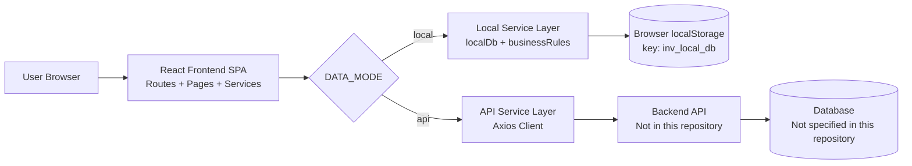

# PCB Inventory Automation Frontend

A role-based React web app for PCB inventory operations with local simulation mode and API-connected mode.

## Table of Contents

- [Introduction](#introduction)
  - [Problem Statement](#problem-statement)
  - [Vision and Mission](#vision-and-mission)
  - [Target Audience](#target-audience)
- [Key Features and Benefits](#key-features-and-benefits)
  - [1. Dual Data Modes Local and API](#1-dual-data-modes-local-and-api)
  - [2. Authentication and Session Persistence](#2-authentication-and-session-persistence)
  - [3. Role-Based Access Control for Write Operations](#3-role-based-access-control-for-write-operations)
  - [4. Component Inventory Search and Inline Editing](#4-component-inventory-search-and-inline-editing)
  - [5. Add Component Workflow](#5-add-component-workflow)
  - [6. PCB Component Mapping Management](#6-pcb-component-mapping-management)
  - [7. Production Entry with Atomic Stock Deduction](#7-production-entry-with-atomic-stock-deduction)
  - [8. Procurement Trigger Lifecycle Automation](#8-procurement-trigger-lifecycle-automation)
  - [9. Dashboard Metrics and Procurement Monitoring](#9-dashboard-metrics-and-procurement-monitoring)
  - [10. Analytics Dashboard and Consumption Insights](#10-analytics-dashboard-and-consumption-insights)
  - [11. Import and Export Operations](#11-import-and-export-operations)
  - [12. Event-Driven Cross-Page Data Refresh](#12-event-driven-cross-page-data-refresh)
- [System Architecture and Design](#system-architecture-and-design)
  - [High-Level Architecture Diagram](#high-level-architecture-diagram)
  - [XLSX Upload Data Flow Diagram](#xlsx-upload-data-flow-diagram)
  - [Tech Stack](#tech-stack)
  - [Design Principles](#design-principles)
  - [Scalability and Reliability Considerations](#scalability-and-reliability-considerations)
- [XLSX Data Processing Workflow](#xlsx-data-processing-workflow)
  - [1. Upload](#1-upload)
  - [2. Parsing and Validation](#2-parsing-and-validation)
  - [3. Data Transformation](#3-data-transformation)
  - [4. Storage](#4-storage)
  - [5. Output and Visualization](#5-output-and-visualization)
  - [Concrete Example](#concrete-example)
- [Getting Started Setup and Installation](#getting-started-setup-and-installation)
  - [Prerequisites](#prerequisites)
  - [Step by Step Setup](#step-by-step-setup)
  - [Running the Application](#running-the-application)
  - [Verification](#verification)
- [Using the Application User Guide](#using-the-application-user-guide)
  - [1. Login](#1-login)
  - [2. Navigate Main Modules](#2-navigate-main-modules)
  - [3. Manage Components](#3-manage-components)
  - [4. Create PCB Mapping](#4-create-pcb-mapping)
  - [5. Record Production](#5-record-production)
  - [6. Import XLSX and Export CSV](#6-import-xlsx-and-export-csv)
  - [7. Review Dashboard and Analytics](#7-review-dashboard-and-analytics)
  - [8. Validation Feedback and Fixes](#8-validation-feedback-and-fixes)
  - [9. Advanced Features](#9-advanced-features)
- [Configuration and Customization](#configuration-and-customization)
- [Troubleshooting](#troubleshooting)
- [Contributing](#contributing)

## Introduction

### Problem Statement

PCB manufacturing workflows depend on accurate component stock, correct PCB-to-component mappings, and reliable production consumption tracking. Manual tracking creates stock mismatch, missed procurement signals, and delayed decisions.

This codebase addresses that by providing a single web UI where teams can:
- manage component inventory,
- map components to PCB definitions,
- log production runs that deduct inventory,
- detect low-stock conditions automatically,
- review analytics and export operational data.

### Vision and Mission

Based on the implementation and existing `README.md`, the mission is to provide a practical inventory operations frontend that works in:
- `local` mode using seeded workbook-derived data for simulation/training/demo, and
- `api` mode for real backend integration.

Mission statement text is **not explicitly declared** in code comments/docs. *Not specified in codebase*.

### Target Audience

Inferred from pages, entities, and workflow names in code:
- PCB inventory managers
- production planners
- procurement teams
- operations analysts
- developers integrating with backend inventory APIs

## Key Features and Benefits

### 1. Dual Data Modes Local and API

1. **Feature Name & Short Description**  
   Runtime mode switch using `REACT_APP_DATA_MODE` (`local` default, `api` optional).
2. **What Problem Does This Feature Solve?**  
   Enables both offline/local simulation and real backend integration without changing UI code.
3. **Benefit to Users & Companies**  
   Faster onboarding/testing in local mode and production integration in API mode. Quantified ROI is *Not specified in codebase*.
4. **Technical Implementation Deep-Dive**  
   - **System Design**: `src/services/index.js` selects local service adapters or API adapters at startup.  
   - **Algorithms & Data Structures Used**: Static mode branching and object composition.  
   - **Why This Design/Algorithm Was Chosen?**: Keeps page components backend-agnostic by targeting one service contract; simpler than duplicating page logic per environment.  
   - **Code Location**: `src/services/config.js`, `src/services/index.js`.
5. **Unique Approach**  
   Same UI routes and components run unchanged across simulated and API-backed data sources.

### 2. Authentication and Session Persistence

1. **Feature Name & Short Description**  
   Login/logout with session persistence in local storage.
2. **What Problem Does This Feature Solve?**  
   Preserves authenticated state across reloads and guards protected routes.
3. **Benefit to Users & Companies**  
   Reduces repeated sign-ins during active work sessions.
4. **Technical Implementation Deep-Dive**  
   - **System Design**: React Context (`AuthProvider`) stores session and exposes auth actions/hooks.  
   - **Algorithms & Data Structures Used**: Context state object + JSON serialization in `localStorage`.  
   - **Why This Design/Algorithm Was Chosen?**: Lightweight global state for auth; avoids extra state-management dependencies.  
   - **Code Location**: `src/context/AuthContext.js`, `src/hooks/useAuthContext.js`, `src/routes/ProtectedRoute.js`, `src/services/config.js`.
5. **Unique Approach**  
   Unified unauthorized handling using a browser event (`auth:unauthorized`) emitted by axios interceptor.

### 3. Role-Based Access Control for Write Operations

1. **Feature Name & Short Description**  
   Admin-only mutations for inventory, PCB creation, and production entry.
2. **What Problem Does This Feature Solve?**  
   Prevents unauthorized edits and protects operational data integrity.
3. **Benefit to Users & Companies**  
   Clear separation between read-only viewers and editing admins.
4. **Technical Implementation Deep-Dive**  
   - **System Design**: UI checks `isAdmin` from auth context before showing edit/create actions.  
   - **Algorithms & Data Structures Used**: Boolean authorization guards and route redirection.  
   - **Why This Design/Algorithm Was Chosen?**: Immediate UX gating in frontend; simple to reason about.  
   - **Code Location**: `src/components/layout/DashboardLayout.js`, `src/pages/AddComponentPage.js`, `src/pages/CreatePcbPage.js`, `src/pages/ProductionPage.js`.
5. **Unique Approach**  
   Write controls are removed/disabled in UI while still allowing full read analytics/navigation for viewers.

### 4. Component Inventory Search and Inline Editing

1. **Feature Name & Short Description**  
   Component listing with search, low-stock highlighting, and inline edit/save.
2. **What Problem Does This Feature Solve?**  
   Improves discoverability and speed of inventory corrections.
3. **Benefit to Users & Companies**  
   Centralized stock and monthly requirement maintenance with immediate status visibility.
4. **Technical Implementation Deep-Dive**  
   - **System Design**: `ComponentsPage` fetches list, applies search term, supports row-level edit state.  
   - **Algorithms & Data Structures Used**:  
     - `filter()` for search by name/part number,  
     - row state object for editable fields,  
     - conditional rendering for edit/view mode.  
   - **Why This Design/Algorithm Was Chosen?**: Direct list filtering avoids remote round-trips in local mode and keeps UX simple.  
   - **Code Location**: `src/pages/ComponentsPage.js`, `src/services/local/localDb.js :: listComponents(), updateComponent()`.
5. **Unique Approach**  
   Low-stock classification is computed centrally via shared business rules and reflected instantly in table styling.

### 5. Add Component Workflow

1. **Feature Name & Short Description**  
   Form to create new inventory components.
2. **What Problem Does This Feature Solve?**  
   Adds new inventory items without direct DB access.
3. **Benefit to Users & Companies**  
   Structured input reduces malformed records at creation time.
4. **Technical Implementation Deep-Dive**  
   - **System Design**: Controlled form with synchronous validation before service call.  
   - **Algorithms & Data Structures Used**: Numeric parsing (`Number()`), guard clauses, normalized payload object.  
   - **Why This Design/Algorithm Was Chosen?**: Simple client-side validation catches common errors early.  
   - **Code Location**: `src/pages/AddComponentPage.js`, `src/services/local/localDb.js :: createComponent(), normalizeComponent()`.
5. **Unique Approach**  
   Creation pipeline immediately evaluates low-stock conditions and may create procurement trigger events.

### 6. PCB Component Mapping Management

1. **Feature Name & Short Description**  
   Create and view PCB definitions with per-component quantity mappings.
2. **What Problem Does This Feature Solve?**  
   Encodes bill-of-material style relationships required for production deduction.
3. **Benefit to Users & Companies**  
   Standardizes production input and makes downstream deduction deterministic.
4. **Technical Implementation Deep-Dive**  
   - **System Design**: Dynamic rows in create form; PCB listing resolves component IDs to names for readability.  
   - **Algorithms & Data Structures Used**:  
     - Array row model with add/remove operations,  
     - map/reduce for lookup map `componentId -> componentName`.  
   - **Why This Design/Algorithm Was Chosen?**: Dynamic list rows are easier than rigid fixed-column schema for variable BOM sizes.  
   - **Code Location**: `src/pages/CreatePcbPage.js`, `src/pages/PcbsPage.js`, `src/services/local/localDb.js :: createPcb(), normalizePcb()`.
5. **Unique Approach**  
   Mapping entry is intentionally lightweight and works for both local and API backends with the same payload structure.

### 7. Production Entry with Atomic Stock Deduction

1. **Feature Name & Short Description**  
   Submit production quantity for a PCB and atomically deduct all required component stock.
2. **What Problem Does This Feature Solve?**  
   Prevents partial updates and negative inventory from inconsistent deductions.
3. **Benefit to Users & Companies**  
   Reliable stock movements and immediate visibility of deduction outcomes.
4. **Technical Implementation Deep-Dive**  
   - **System Design**: `createProductionEntry()` computes full deduction set, validates sufficiency, then applies updates.  
   - **Algorithms & Data Structures Used**:  
     - `map()` to calculate required quantities,  
     - `filter()` to detect insufficiency,  
     - transactional-style batch mutation in one function scope.  
   - **Why This Design/Algorithm Was Chosen?**: Validate-before-mutate pattern avoids partial writes; simpler than rollback logic after failure.  
   - **Code Location**: `src/services/local/localDb.js :: createProductionEntry()`, `src/pages/ProductionPage.js`.
5. **Unique Approach**  
   Atomic validation plus explicit negative-inventory guard: `"Negative inventory prevented by atomic validation."`.

### 8. Procurement Trigger Lifecycle Automation

1. **Feature Name & Short Description**  
   Auto-create pending trigger when stock becomes low; auto-resolve when stock recovers.
2. **What Problem Does This Feature Solve?**  
   Eliminates manual monitoring and keeps procurement queue synchronized with real stock state.
3. **Benefit to Users & Companies**  
   Faster reaction to shortages and lower chance of missing replenishment action.
4. **Technical Implementation Deep-Dive**  
   - **System Design**: Trigger lifecycle is embedded in component create/update and production deduction flows.  
   - **Algorithms & Data Structures Used**: state-transition checks (`wasLow -> isLow`), array search for existing pending trigger.  
   - **Why This Design/Algorithm Was Chosen?**: Evented state transitions are low-overhead and deterministic versus periodic polling.  
   - **Code Location**: `src/services/local/localDb.js :: upsertProcurementTrigger(), syncProcurementStateForCurrentStock()`.
5. **Unique Approach**  
   Enforces one active pending trigger per component and preserves audit fields (`triggeredAt`, `resolvedAt`, snapshot).

### 9. Dashboard Metrics and Procurement Monitoring

1. **Feature Name & Short Description**  
   Summary KPI cards plus procurement trigger table with status filters.
2. **What Problem Does This Feature Solve?**  
   Gives operators a quick control-plane view of inventory health and procurement workload.
3. **Benefit to Users & Companies**  
   Faster daily review and prioritization.
4. **Technical Implementation Deep-Dive**  
   - **System Design**: Parallel fetch of summary + trigger list; filter chip reloads data by status.  
   - **Algorithms & Data Structures Used**: `Promise.all`, sorted trigger list (`new Date(...).getTime()` descending).  
   - **Why This Design/Algorithm Was Chosen?**: Parallel requests reduce wait time; simple sort/filter fits expected record volume.  
   - **Code Location**: `src/pages/DashboardPage.js`, `src/services/local/localDb.js :: getDashboardSummary(), listProcurementTriggers()`.
5. **Unique Approach**  
   Combined KPI + lifecycle table in one page with real-time reload on custom data-change events.

### 10. Analytics Dashboard and Consumption Insights

1. **Feature Name & Short Description**  
   Displays top consumed components chart, consumption history table, and low-stock list.
2. **What Problem Does This Feature Solve?**  
   Converts operational events into decision-ready insights.
3. **Benefit to Users & Companies**  
   Better visibility of usage concentration and at-risk components.
4. **Technical Implementation Deep-Dive**  
   - **System Design**: Four analytics endpoints/services loaded in parallel, rendered into cards/chart/table/list.  
   - **Algorithms & Data Structures Used**:  
     - aggregation via `reduce()` (`getTopConsumed()`),  
     - sort + slice top-10 ranking,  
     - Recharts bar visualization.  
   - **Why This Design/Algorithm Was Chosen?**: In-memory aggregation is straightforward for local mode and backend parity in API mode.  
   - **Code Location**: `src/pages/AnalyticsPage.js`, `src/services/local/localDb.js :: getTopConsumed(), getConsumptionHistory(), getLowStockComponents()`.
5. **Unique Approach**  
   Uses the same analytics screen contract regardless of whether data comes from local simulation or external API.

### 11. Import and Export Operations

1. **Feature Name & Short Description**  
   Import `.xlsx/.xlsm` files and export inventory/consumption CSV files.
2. **What Problem Does This Feature Solve?**  
   Supports spreadsheet-based workflows and downstream reporting.
3. **Benefit to Users & Companies**  
   Easier data exchange with external teams using spreadsheet tooling.
4. **Technical Implementation Deep-Dive**  
   - **System Design**: File input collects selected files and delegates to import service per mode.  
   - **Algorithms & Data Structures Used**: extension whitelist check (`xlsx`, `xlsm`), CSV row construction via array join, Blob download.  
   - **Why This Design/Algorithm Was Chosen?**: Minimal browser-native implementation, no extra parsing lib in frontend runtime.  
   - **Code Location**: `src/pages/ImportExportPage.js`, `src/services/local/localDb.js :: importExcel(), exportInventory(), exportConsumption()`, `src/services/api/importExportService.js`.
5. **Unique Approach**  
   In local mode, import intentionally performs deterministic seed replacement for consistent demos/training.

### 12. Event-Driven Cross-Page Data Refresh

1. **Feature Name & Short Description**  
   Browser custom event bus refreshes multiple pages after data mutations.
2. **What Problem Does This Feature Solve?**  
   Prevents stale views when changes happen on different routes.
3. **Benefit to Users & Companies**  
   Improves consistency without full page reload.
4. **Technical Implementation Deep-Dive**  
   - **System Design**: `emitDataChange()` dispatches `inventory:data-changed`; pages subscribe via `onDataChange()`.  
   - **Algorithms & Data Structures Used**: Publish-subscribe event pattern with metadata payload.  
   - **Why This Design/Algorithm Was Chosen?**: Lightweight alternative to global store libraries for this app size.  
   - **Code Location**: `src/utils/dataEvents.js`, multiple pages (`DashboardPage`, `ComponentsPage`, `PcbsPage`, `AnalyticsPage`).
5. **Unique Approach**  
   Unified event mechanism works in both local and API modes and decouples mutation source from update consumers.

## System Architecture and Design

### High-Level Architecture Diagram



### XLSX Upload Data Flow Diagram

```mermaid
flowchart TD
  A[User selects .xlsx/.xlsm in Import/Export page] --> B{Mode}
  B -->|local| C[Validate extension only]
  C --> D[replaceDbWithSeedData]
  D --> E[Save inv_local_db in localStorage]
  E --> F[Emit import_completed event]
  F --> G[Dashboard/Analytics refresh]

  B -->|api| H[Create FormData files[]]
  H --> I[POST /import-export/import]
  I --> J[Backend parsing/validation/transforms]
  J --> K[Backend persistence]
  K --> L[Frontend receives response and refreshes]
```

### Tech Stack

| Layer | Technology | Version / Source |
|---|---|---|
| Frontend framework | React | `^18.3.1` (`package.json`) |
| DOM renderer | React DOM | `^18.3.1` |
| Routing | React Router DOM | `^6.28.0` |
| HTTP client | Axios | `^1.8.4` |
| Charting | Recharts | `^2.15.1` |
| Build/runtime scripts | react-scripts | `5.0.1` |
| JavaScript runtime | Node.js | *Not specified in codebase* |
| Package manager | npm | implied by `package-lock.json` |
| Local data store | Browser `localStorage` | key `inv_local_db` |
| Backend | External API (`REACT_APP_API_BASE_URL`) | implementation *Not in this repo* |
| Database engine | *Not specified in this codebase* | N/A |
| Python tooling (optional seed generation) | Python script using stdlib only | `scripts/generate_seed.py` |
| Docker/Compose | *Not specified in codebase* | N/A |

### Design Principles

- **Frontend monolith SPA**: Single React app with route-based pages.
- **Service abstraction boundary**: page components call `services.*`; mode decides local/api implementation.
- **Event-driven UI synchronization**: custom browser events trigger reactive re-fetching.
- **Deterministic local simulation**: local import resets to known seed payload.
- **Business-rule centralization**: low-stock logic in `src/utils/businessRules.js` reused across flows.

Architecture style names like MVC/Clean Architecture are *not explicitly declared* in the codebase.

### Scalability and Reliability Considerations

Observed from implementation:
- Local mode scales only to browser memory/storage constraints; no distributed consistency.
- API mode offloads scalability to backend (not available in this repository).
- Reliability controls present in local mode:
  - guarded numeric normalization (`toNumber`, `positiveNumberOrZero`),
  - atomic production validation before stock mutation,
  - automatic reseed if local DB parse fails (`getDb()` fallback to `seedDb()`).
- Missing/unspecified items in repo:
  - retries/circuit breakers,
  - backend idempotency guarantees,
  - persistence replication/backup strategy.

## XLSX Data Processing Workflow

### 1. Upload

Frontend upload path:
- UI element: `Import Files` button on `ImportExportPage` with file picker input (`multiple`, `accept=".xlsx,.xlsm"`).
- Interaction style: **file picker** (drag-and-drop not implemented).
- Accepted formats: `.xlsx`, `.xlsm`.
- File size limits: *Not specified in codebase*.

### 2. Parsing and Validation

#### Runtime behavior in `local` mode

- Parsing library: **None used at runtime**.
- Validation rules implemented in frontend:
  - at least one file selected,
  - extension must be `xlsx` or `xlsm`.
- If validation fails:
  - throws/sets UI error such as:
    - `Select at least one .xlsx or .xlsm file.`
    - `Unsupported file type for <file>. Allowed: .xlsx, .xlsm`

Relevant runtime code:

```js
function importExcel(files) {
  const allowed = ["xlsx", "xlsm"];
  for (const file of files) {
    const extension = file.name.split(".").pop().toLowerCase();
    if (!allowed.includes(extension)) {
      throw new Error(`Unsupported file type for ${file.name}. Allowed: .xlsx, .xlsm`);
    }
  }
  replaceDbWithSeedData(db);
}
```

Source: `src/services/local/localDb.js :: importExcel()`.

#### Runtime behavior in `api` mode

- Frontend creates `FormData` and sends files to `POST /import-export/import`.
- Parsing/validation logic is backend-side and **not present in this repository**.
- Required columns, type checks, range checks, and custom backend validation: *Not specified in this codebase*.

#### Offline seed-generation script (non-runtime)

`scripts/generate_seed.py` includes workbook parsing logic used to produce `src/assets/seedData.json`:
- reads workbook zip/XML directly (`zipfile`, `xml.etree.ElementTree`),
- parses shared strings and sheet cells,
- extracts component/PCB/consumption data from specific sheets,
- handles Excel serial dates and date-format parsing,
- filters placeholder tokens (`NA`, `N/A`, etc.).

This script is **not** called by the app’s upload flow at runtime.

### 3. Data Transformation

#### Runtime transformation in `local` mode

After extension validation, local import replaces entire DB using pre-generated seed and normalizes records:
- component normalization (`normalizeComponent`) adds:
  - `id` fallback,
  - numeric coercion,
  - `updatedAt`,
  - computed `lowStockThreshold`/`isLowStock` via `enrichComponent`.
- PCB normalization (`normalizePcb`) coerces `quantityPerComponent` and timestamps.
- procurement state sync runs after seed load.

Main transformation functions:
- `src/services/local/localDb.js :: replaceDbWithSeedData()`
- `src/services/local/localDb.js :: normalizeComponent()`
- `src/services/local/localDb.js :: normalizePcb()`
- `src/utils/businessRules.js :: enrichComponent()`

#### Runtime transformation in `api` mode

Transformation behavior is backend-side. *Not specified in this codebase*.

### 4. Storage

#### Local mode storage model

Processed data is saved in browser localStorage key `inv_local_db`.

Document shape (JSON object):

```json
{
  "components": [
    {
      "id": "cmp-*",
      "name": "string",
      "partNumber": "string",
      "currentStockQty": "number",
      "monthlyRequiredQty": "number",
      "lowStockThreshold": "number",
      "isLowStock": "boolean",
      "createdAt": "ISO datetime",
      "updatedAt": "ISO datetime"
    }
  ],
  "pcbs": [{ "id": "pcb-*", "name": "string", "components": [] }],
  "productionEntries": [],
  "procurementTriggers": [],
  "consumptionHistory": [],
  "importHistory": []
}
```

SQL tables/migrations: *Not specified in this repository*.

#### API mode storage

Database schema/tables are backend-owned and *Not specified in this codebase*.

### 5. Output and Visualization

After import, data is surfaced through:
- Dashboard metric cards + procurement table (`/dashboard`)
- Component inventory table (`/components`)
- PCB mappings table (`/pcbs`)
- Analytics chart and tables (`/analytics`)

Export formats implemented in frontend:
- `CSV` inventory export (`Export Inventory` button)
- `CSV` consumption export (`Export Consumption` button)

Other export formats (PDF/JSON/XLSX output): *Not specified in codebase*.

### Concrete Example

If a user uploads `sales_q1.xlsx`:
- In **local mode** (`REACT_APP_DATA_MODE=local`), the frontend only validates extension `.xlsx/.xlsm`; file contents are not parsed in runtime. The app replaces current DB with pre-analyzed seed data from `src/assets/seedData.json`, logs an import record, and refreshes dashboards.
- In **api mode** (`REACT_APP_DATA_MODE=api`), the frontend sends file bytes to backend endpoint `/import-export/import` as multipart form data. Parsing/transformation details depend on backend code, which is not included here.

## Getting Started Setup and Installation

### Prerequisites

- OS: Windows/macOS/Linux (cross-platform expected for Node tooling).
- Node.js: *Not specified in codebase*.
- npm: implied by `package-lock.json`.
- Python: only needed if running seed-generation script; version *Not specified in codebase*.
- Backend API: required only for `api` mode; setup details *Not included in this repo*.

### Step by Step Setup

#### 1. Clone the Repository

```bash
git clone <your-repository-url>
cd InvictusDay1
```

#### 2. Install Dependencies

```bash
npm install
```

#### 3. Environment Configuration

Copy env template:

```bash
cp .env.example .env
```

PowerShell equivalent:

```powershell
Copy-Item .env.example .env
```

Environment variables from `.env.example`:

| Variable | Description | Accepted Values | Default / Example |
|---|---|---|---|
| `REACT_APP_DATA_MODE` | Selects data source mode | `local` or `api` | `local` |
| `REACT_APP_API_BASE_URL` | Base URL used by axios client in API mode | valid HTTP(S) URL | `http://localhost:5000/api` |

#### 4. Database Setup

- **Local mode**: no external DB setup required (uses browser localStorage).
- **API mode**: backend/database setup commands are *Not specified in this repository*.
- Migration commands: *Not specified in this repository*.

#### 5. Build the Frontend

```bash
npm run build
```

### Running the Application

Development mode (hot reload via `react-scripts start`):

```bash
npm start
```

Typical access URL:
- `http://localhost:3000` (CRA default; explicit port config is not declared in repo).

Production mode:
- `npm run build` creates static assets in `build/`.
- Production serving strategy is *Not specified in this codebase*.

### Verification

Successful startup checks:
- Browser loads login page and route navigation works.
- In local mode, login with:
  - `admin@local.test / Admin@123`
  - `viewer@local.test / Viewer@123`

Backend health endpoint (e.g., `/api/health`) is *Not specified in this frontend repository*.

## Using the Application User Guide

### 1. Login

- Open app URL.
- Enter credentials in `Email` and `Password`.
- Click `Login`.
- [INSERT SCREENSHOT HERE]

### 2. Navigate Main Modules

Sidebar menu includes:
- `Dashboard`
- `Components`
- `PCBs`
- `Production`
- `Analytics`
- `Import/Export`

[INSERT SCREENSHOT HERE]

### 3. Manage Components

- Go to `Components`.
- Use search input `Search by component or part number` and click `Search`.
- Admin users:
  - click `Add Component` to create new entries,
  - click `Edit` in a row, update values, click `Save`.
- Viewer users: read-only.

[INSERT SCREENSHOT HERE]

### 4. Create PCB Mapping

- Go to `PCBs` -> click `Create PCB`.
- Fill `PCB Name`.
- Add mapping rows with component selector + `Qty per component`.
- Click `Create PCB`.

[INSERT SCREENSHOT HERE]

### 5. Record Production

- Go to `Production`.
- Choose PCB from `Select PCB`.
- Enter `Quantity to Produce`.
- Click `Submit Production`.
- Review:
  - `Deduction Result` table,
  - `Updated Stock Snapshot` table.

[INSERT SCREENSHOT HERE]

### 6. Import XLSX and Export CSV

- Go to `Import/Export`.
- Use file picker `Upload Excel Files (.xlsx, .xlsm)`.
- Click `Import Files`.
- For exports, click:
  - `Export Inventory`
  - `Export Consumption`

[INSERT SCREENSHOT HERE]

### 7. Review Dashboard and Analytics

- Dashboard:
  - KPI cards for totals and low-stock counts,
  - procurement records with status filters (`All`, `Pending`, `Resolved`).
- Analytics:
  - `Top Consumed Components` bar chart,
  - `Component Consumption History` table,
  - `Low Stock Components` list.

[INSERT SCREENSHOT HERE]

### 8. Validation Feedback and Fixes

- Form errors appear as inline status messages.
- Example fixes:
  - if `Monthly required quantity must be greater than zero.`, enter value > 0.
  - if `Unsupported file type...`, upload `.xlsx` or `.xlsm` only.

### 9. Advanced Features

Features like scheduled imports, alerting pipelines, or report scheduling are *Not specified in codebase*.

## Configuration and Customization

Supported customization points from code:

- **Data mode switch**: `.env` -> `REACT_APP_DATA_MODE=local|api`.
- **API endpoint switch**: `.env` -> `REACT_APP_API_BASE_URL`.
- **Low stock rule**: change `LOW_STOCK_RATIO` in `src/utils/businessRules.js` (default `0.2`).
- **Seed dataset**: update `src/assets/seedData.json` or regenerate with `scripts/generate_seed.py`.
- **UI styles**: edit CSS variables in `src/styles.css`.

Not available in codebase:
- feature flags framework,
- centralized validation config files,
- runtime admin settings panel.

## Troubleshooting

| Error Message | Cause | Fix |
|---|---|---|
| `Email and password are required.` | Login form submitted empty | Enter both fields and retry. |
| `Invalid credentials for local mode.` | Wrong local demo credentials | Use `admin@local.test / Admin@123` or `viewer@local.test / Viewer@123`. |
| `Name and Part Number are required.` | Missing required component fields | Fill both fields before submit/save. |
| `Current stock quantity must be a non-negative number.` | Invalid stock input | Enter `0` or greater. |
| `Monthly required quantity must be greater than zero.` | Invalid monthly requirement | Enter a value > `0`. |
| `PCB name is required.` | Empty PCB name | Provide non-empty PCB name. |
| `Add at least one component mapping row.` | No mapping rows selected | Add at least one component row with a selected component. |
| `Quantity per component must be greater than zero.` | Invalid mapping quantity | Use positive integer/number. |
| `Only Admin can create production entries.` | Viewer user attempted write | Login as Admin role. |
| `Select a PCB.` | Production submission without PCB | Select a PCB first. |
| `Quantity to produce must be greater than zero.` | Invalid production quantity | Enter a value > `0`. |
| `Insufficient stock: ...` | Requested production exceeds available stock | Lower production quantity or replenish component stock. |
| `Unsupported file type for <file>. Allowed: .xlsx, .xlsm` | Wrong import extension | Upload only `.xlsx` or `.xlsm`. |
| `Select at least one .xlsx or .xlsm file.` | Import clicked with no selection | Select one or more files first. |
| `Component not found.` / `PCB not found.` | Stale ID or deleted/missing entity | Refresh data and retry with valid records. |
| `Failed to load ...` / `Import failed.` in API mode | API unavailable or backend error | Verify `REACT_APP_API_BASE_URL`, backend status, auth token validity. |

## Contributing

Contribution policy details are mostly *Not specified in codebase*.

Current repository signals:
- npm scripts available: `start`, `build`, `test`, `eject`.
- No explicit branch naming convention file found.
- No PR template found.
- No standalone ESLint/Prettier/Pylint config files found in root.

If you plan to contribute, a practical baseline is:
1. Create a feature branch.
2. Implement changes with focused commits.
3. Run `npm test`.
4. Open a pull request with behavior summary and screenshots for UI changes.

(Items above are workflow suggestions; formal contribution governance is not defined in repository files.)

