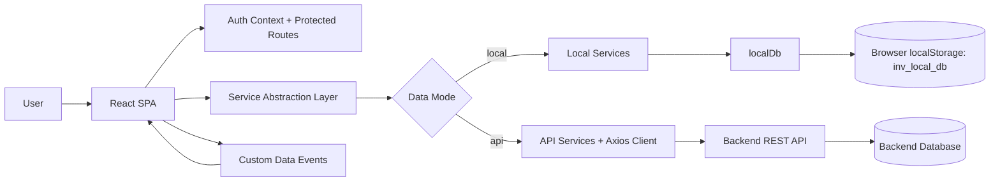

# PCB Inventory Automation: Solution Deep Dive

This document explains the complete solution from a product + architecture perspective: what is already built, how each part works, current project progress, and a practical roadmap to scale it.

## 1. Solution Overview

The project is a React-based web application for PCB inventory operations. It supports two runtime modes:
- `local` mode for simulation/demo/training using seeded data in browser storage.
- `api` mode for real backend integration via REST endpoints.

The core operational flow implemented today:
1. Authenticate user.
2. Manage component inventory and PCB mappings.
3. Record production entries that deduct component stock atomically.
4. Auto-generate procurement triggers when stock is low.
5. View dashboard and analytics.
6. Import spreadsheet files and export CSV reports.

## 2. What Problem This Solves

In PCB operations, teams usually track inventory, consumption, and production in disconnected spreadsheets. That creates delayed procurement decisions and stock mismatch risk.

This system consolidates those workflows in one app with built-in business rules:
- low-stock threshold computed as 20% of monthly requirement,
- non-negative inventory guarantees during production deduction,
- procurement trigger lifecycle automation (`pending` to `resolved`).

## 3. Final Solution Architecture



### 3.1 Architectural Pattern Used

The frontend follows a practical layered pattern:
- Presentation layer: pages + reusable UI components.
- Application/service layer: mode-agnostic service interface.
- Domain/business rule layer: stock threshold and validation utilities.
- Data layer:
  - local mode: browser `localStorage` document model,
  - api mode: backend REST endpoints.

This pattern was chosen to keep page code stable while switching data source by environment.

## 4. Tech Stack and How It Is Used

### 4.1 Frontend Framework and Routing
- `react` and `react-dom` power the SPA and rendering.
- `react-router-dom` defines authenticated route structure and feature pages.
- `ProtectedRoute` gates all non-login routes based on session token.

### 4.2 HTTP and Integration
- `axios` is used for API mode with:
  - base URL from `REACT_APP_API_BASE_URL`,
  - bearer token injection from local auth storage,
  - global `401` unauthorized event handling.

### 4.3 Analytics and Visualization
- `recharts` renders the top-consumed-components bar chart.

### 4.4 Local Simulation Runtime
- Browser `localStorage` stores document `inv_local_db`.
- `localDb` provides CRUD + production deduction + procurement trigger logic.

### 4.5 Data Seeding Utility
- `scripts/generate_seed.py` produces `src/assets/seedData.json` from workbook sources.
- It parses Excel workbook XML directly (zip + XML trees) without third-party Python packages.

### 4.6 Build and Scripts
- `react-scripts` provides development server, build, and test command support.

## 5. System Design Details (Key Subsystems)

### 5.1 Authentication and Access Control
- Session stored under `inv_auth_session` in browser storage.
- Login/logout handled by `AuthContext`.
- UI exposes `isAdmin` and enforces read-only behavior for viewer users.

### 5.2 Inventory Domain Model
Main local DB collections:
- `components`
- `pcbs`
- `productionEntries`
- `procurementTriggers`
- `consumptionHistory`
- `importHistory`

Each component is enriched with derived fields:
- `lowStockThreshold = monthlyRequiredQty * 0.2`
- `isLowStock` boolean.

### 5.3 Production Transaction Design
`createProductionEntry()` applies a validate-then-commit sequence:
1. Resolve selected PCB and required quantities.
2. Detect insufficient stock for any mapped component.
3. Abort if any failure (no partial writes).
4. Deduct stock for all mapped components.
5. Append production and consumption history records.
6. Update procurement trigger state transitions.

This design prevents negative inventory and partial deduction side effects.

### 5.4 Procurement Trigger Lifecycle
Trigger transitions are state-based:
- `Normal -> Low`: create `pending` trigger (if not already pending).
- `Low -> Normal`: mark pending trigger as `resolved`.

This rule is reused in:
- component creation,
- component update,
- production deduction,
- seed sync.

### 5.5 Event-Driven UI Refresh
The app dispatches `inventory:data-changed` custom events after mutations.
Pages subscribe and reload data on event receipt.

Benefit: keeps dashboard/analytics/lists synchronized without full refresh.

## 6. XLSX Flow in the Final Project

### 6.1 Runtime Flow (`Import/Export` page)
- User selects files via file picker (`accept=.xlsx,.xlsm`, multiple).
- Frontend validates extension only.
- Local mode: import action replaces DB with seed dataset and records import history.
- API mode: uploads files as `multipart/form-data` to `/import-export/import`.

### 6.2 Important Clarification
- Runtime local mode does not parse spreadsheet cell contents in browser.
- Spreadsheet parsing logic in this repository exists in offline seed-generation script (`scripts/generate_seed.py`), not in frontend runtime upload path.

## 7. Current Progress Snapshot (Based on Implemented Code)

### 7.1 Completed Functional Areas
- Login and protected routing.
- Role-aware UI behavior (Admin vs Viewer).
- Components list/search/add/edit.
- PCB mapping creation and listing.
- Production entry with inventory deduction and stock snapshot.
- Dashboard KPIs and procurement trigger table.
- Analytics page with chart, history table, low-stock list.
- Import/export page with XLSX/XLSM acceptance and CSV exports.
- Dual mode data abstraction (`local` and `api`).

### 7.2 Current Seed Dataset Scale
From current `src/assets/seedData.json`:
- Components: `133`
- PCBs: `16`
- Production entries: `16`
- Procurement triggers: `0`
- Consumption history records: `2202`

### 7.3 What Is Not in This Repository
- Backend implementation and database schema/migrations.
- Deployment manifests (Docker/Kubernetes/CI pipeline files).
- Explicit production SLO/SLA definitions.

## 8. Detailed Feature Walkthrough of the Final Project

### 8.1 Login and Role Experience
- `LoginPage` validates required email/password.
- Local credentials available for admin and viewer.
- Sidebar/topbar show current user and role.

### 8.2 Components Module
- Search by component name or part number.
- Table shows stock, monthly requirement, threshold, and status.
- Inline editing available to admins.
- Validation enforces non-negative stock and positive monthly requirement.

### 8.3 PCB Mapping Module
- Create PCB name and any number of mapping rows.
- Each row links a component and required quantity per PCB unit.
- Listing page resolves component IDs to readable names.

### 8.4 Production Module
- Select PCB and quantity to produce.
- System computes per-component deductions.
- On success, shows deduction result and updated stock snapshot.
- On failure, returns detailed insufficient stock error.

### 8.5 Dashboard Module
- Summary metrics:
  - total components,
  - low-stock count,
  - total production entries,
  - pending procurement triggers.
- Procurement record table filterable by `all/pending/resolved`.

### 8.6 Analytics Module
- Top consumed components bar chart.
- Consumption history timeline table.
- Low-stock list summary.

### 8.7 Import/Export Module
- Import `.xlsx/.xlsm` through file picker.
- Export inventory and consumption as CSV files.

## 9. Scalability View: Current State and Upgrade Path

### 9.1 Current State
- Local mode is ideal for demos/training and constrained data volumes.
- API mode delegates scale concerns to backend.
- Frontend already has clean service boundaries to support backend evolution.

### 9.2 Scalability Roadmap (Proposed)

1. Backend scale foundation:
- Introduce DB indexing on component/PCB/procurement query paths.
- Implement pagination for component/history endpoints.

2. Reliability and consistency:
- Add idempotency keys for import and production submission.
- Add optimistic locking/version fields for concurrent stock updates.

3. Performance:
- Virtualized large tables on frontend.
- Cached analytics endpoints for frequently viewed dashboards.

4. Observability:
- Structured logging for import and production flows.
- Metrics for low-stock trigger rates and import success/failure.

5. Security hardening:
- Token refresh and stricter session expiry policies.
- Fine-grained backend authorization per write endpoint.

These items are forward-looking and not yet implemented in this repository.

## 10. Future Plans and Product Roadmap

### Near-Term (Suggested)
- Add explicit Reset DB action in UI for local mode.
- Add import result summary table (accepted/rejected files).
- Add filters/sorting controls in components and history tables.

### Mid-Term (Suggested)
- Add backend health/status page integration in frontend.
- Add downloadable analytical reports with date-range filters.
- Add audit trail view for stock and procurement state changes.

### Long-Term (Suggested)
- Multi-plant or multi-warehouse support.
- Forecasting module for proactive procurement planning.
- Event-driven backend pipeline for large-scale ingestion and alerts.

## 11. Why This Solution Is Practical

- It already supports full operational loop in one UI.
- It gives a deterministic local mode for fast onboarding and demos.
- It has a clean boundary to move from simulation to production backend.
- It encodes core inventory safety rules directly into workflows.

## 12. Runbook for Final Demo

1. Set `.env`:
- `REACT_APP_DATA_MODE=local`
- `REACT_APP_API_BASE_URL=http://localhost:5000/api`

2. Install and run:
```bash
npm install
npm start
```

3. Login as admin:
- `admin@local.test / Admin@123`

4. Walkthrough sequence:
- Check Dashboard metrics.
- Go to Components and edit a stock value.
- Go to PCBs and review mappings.
- Go to Production and create one production entry.
- Return to Dashboard/Analytics and observe updates.
- Go to Import/Export and run CSV exports.

5. Optional API mode validation:
- switch `.env` to `REACT_APP_DATA_MODE=api`,
- ensure backend is reachable,
- repeat key workflows.

## 13. Reference File Map

Core entry and routing:
- `src/index.js`
- `src/App.js`
- `src/routes/AppRoutes.js`
- `src/routes/ProtectedRoute.js`

Auth and session:
- `src/context/AuthContext.js`
- `src/services/config.js`
- `src/services/api/authService.js`
- `src/services/local/authService.js`

Business logic and data:
- `src/services/local/localDb.js`
- `src/utils/businessRules.js`
- `src/utils/dataEvents.js`

Feature pages:
- `src/pages/LoginPage.js`
- `src/pages/DashboardPage.js`
- `src/pages/ComponentsPage.js`
- `src/pages/AddComponentPage.js`
- `src/pages/PcbsPage.js`
- `src/pages/CreatePcbPage.js`
- `src/pages/ProductionPage.js`
- `src/pages/AnalyticsPage.js`
- `src/pages/ImportExportPage.js`

Service abstraction:
- `src/services/index.js`
- `src/services/local/*.js`
- `src/services/api/*.js`

Seed dataset and generation:
- `src/assets/seedData.json`
- `scripts/generate_seed.py`
